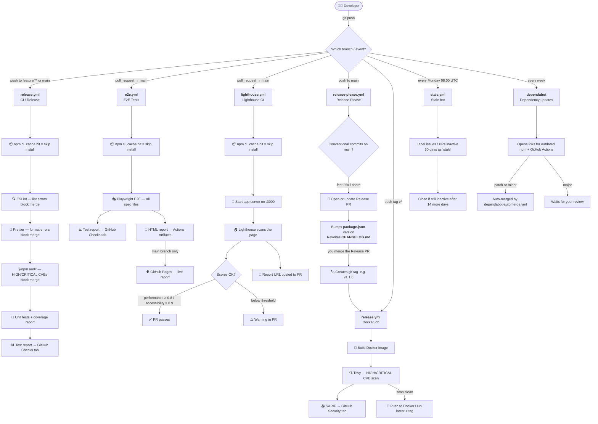

# Development Guide

Everything a developer needs to work on this project — local setup, CI/CD pipeline explained, tools, and how to cut a release.

---

## CI/CD Pipeline — Full Flow



---

## Workflows at a Glance

| Workflow | Trigger | Tools | Output / Failure |
|---|---|---|---|
| `release.yml` — test job | push to `main`/`feature/**`, PR to `main` | ESLint, Prettier, npm audit, Node test runner | Blocks merge on any lint/format/audit/test failure |
| `release.yml` — docker job | push tag `v*` | Docker Buildx, Trivy | Blocks push if HIGH/CRITICAL CVE found |
| `e2e.yml` | push to `main`/`feature/**`, PR to `main` | Playwright | Blocks merge on test failure; HTML report on GitHub Pages |
| `lighthouse.yml` | PR to `main` | Lighthouse CI | Warns (not blocks) if performance < 0.8 or accessibility < 0.9 |
| `release-please.yml` | push to `main` | release-please-action | Opens a Release PR; creates tag on merge |
| `stale.yml` | every Monday | actions/stale | Cleans up inactive issues + PRs automatically |
| `dependabot.yml` | weekly | Dependabot | PRs for outdated npm + Actions deps; auto-merges patch/minor |

---

## Local Development

### Install

```bash
git clone https://github.com/seab4ng/helm-values-editor.git
cd helm-values-editor
npm ci
```

### Run the app

```bash
npm start          # serves app/ on http://localhost:3000
```

Open in **Chrome or Edge** (requires File System Access API).

### Run unit tests

```bash
npm test                  # run tests
npm run test:coverage     # run tests + print coverage table
```

### Run e2e tests

```bash
npm run test:e2e          # all Playwright specs
npx playwright test --ui  # interactive GUI mode
npx playwright test tests/e2e/apply-values.spec.js  # single file
```

---

## Code Quality Tools

### ESLint — logic errors

Finds real bugs before runtime: undefined variables, dead code, `==` vs `===`, etc.

```bash
npm run lint        # show all errors and warnings
npm run lint:fix    # auto-fix what ESLint can fix automatically
```

**What CI does:** `npm run lint` — exits non-zero on any error → merge blocked.  
**Config:** `eslint.config.mjs`  
**Scope:** `app/lib.js`, `tests/**`, `playwright.config.js`

### Prettier — code formatting

Auto-formats indentation, quotes, trailing commas, line length. No style debates in PRs.

```bash
npm run format        # reformat all files in place (run before committing)
npm run format:check  # check only, no write (what CI runs)
```

**Workflow:** write code → `npm run format` → commit → CI passes.  
**Config:** `.prettierrc`, `.prettierignore`

### npm audit — dependency vulnerabilities

```bash
npm audit                        # show all issues
npm audit --audit-level=high     # exit 1 only on HIGH/CRITICAL (what CI runs)
npm audit fix                    # auto-upgrade vulnerable packages
```

**What CI does:** runs on every push; blocks merge if HIGH/CRITICAL CVE found in `package-lock.json`.

---

## Releasing a New Version

This project uses **release-please** to automate versioning. You never run `git tag` manually.

### Step 1 — Write conventional commits

```
feat: add CSV export for diff view
fix: revert button missing on dotted-key fields
chore: update Playwright to 1.60
docs: add Lighthouse CI section to dev guide
```

| Prefix | Version bump |
|---|---|
| `feat:` | minor — `1.0.x` → `1.1.0` |
| `fix:` | patch — `1.0.0` → `1.0.1` |
| `feat!:` or body contains `BREAKING CHANGE:` | major — `1.x` → `2.0.0` |
| `chore:` `docs:` `test:` `ci:` | no bump |

### Step 2 — Merge to main

Push your feature branch → open PR → merge to `main`.

After the merge, **release-please** automatically:
1. Opens (or updates) a PR titled `chore(release): v1.x.x`
2. Bumps `package.json` version
3. Rewrites `CHANGELOG.md` with all `feat:` / `fix:` entries grouped

### Step 3 — Merge the Release PR

Review the auto-generated Release PR. When ready to ship:
- Merge it → release-please creates the git tag → `release.yml` Docker job fires → image pushed to Docker Hub.

### Step 4 — Done

Docker Hub gets `latest` + the version tag. GitHub Releases page gets a release note entry.

---

## Coverage Report

Coverage prints in the CI log after unit tests run. No badge (yet) — add Codecov if you want a PR comment with % diff.

To see coverage locally:

```bash
npm run test:coverage
```

Output example:
```
─────────────────────────────┬──────────┬──────────┬──────────────
File                          │ % Stmts  │ % Branch │ % Functions
─────────────────────────────┼──────────┼──────────┼──────────────
app/lib.js                   │   94.3%  │   87.2%  │    100%
─────────────────────────────┴──────────┴──────────┴──────────────
```

---

## Lighthouse CI

Runs on every PR to `main`. Loads the app in headless Chrome and scores it.

| Category | Threshold | Action |
|---|---|---|
| Performance | ≥ 0.80 | warn in PR |
| Accessibility | ≥ 0.90 | warn in PR |
| Best practices | ≥ 0.90 | warn in PR |

A link to the full Lighthouse report is posted as a comment on the PR.

**Config:** `.lighthouserc.json`  
**Not the same as Playwright** — Playwright tests JS logic ("does Apply button work?"). Lighthouse tests page quality ("is the page fast? are inputs labelled for screen readers?").

---

## Secrets Required

| Secret | Used by | Where to set |
|---|---|---|
| `DOCKERHUB_USERNAME` | `release.yml` docker job | GitHub → Settings → Secrets → Actions |
| `DOCKERHUB_TOKEN` | `release.yml` docker job | GitHub → Settings → Secrets → Actions |
| `GITHUB_TOKEN` | all workflows | Automatically provided by GitHub — no setup needed |

---

## Project Structure

```
helm-values-editor/
├── app/
│   ├── index.html          # entire frontend (single file, no build step)
│   ├── lib.js              # pure utility functions (flatten, coerce, search, tree)
│   └── vendor/             # vendored js-yaml (copied at build/test time)
├── tests/
│   ├── unit.js             # unit tests for lib.js (Node built-in test runner)
│   ├── e2e/                # Playwright end-to-end tests
│   │   ├── helpers/        # mock FSAPI, fixtures
│   │   └── *.spec.js       # one spec file per feature
│   └── fixtures/           # YAML fixtures for e2e mocks
├── .github/
│   ├── workflows/          # all CI/CD workflows
│   ├── CODEOWNERS          # auto-assigns reviewers on PRs
│   ├── ISSUE_TEMPLATE/     # bug report + feature request templates
│   └── PULL_REQUEST_TEMPLATE.md
├── docs/
│   └── development.md      # ← you are here
├── eslint.config.mjs       # ESLint rules
├── .prettierrc             # Prettier formatting rules
├── .lighthouserc.json      # Lighthouse CI thresholds
├── playwright.config.js    # Playwright configuration
├── Dockerfile              # two-stage: node (vendor) + nginx (serve)
└── package.json
```
